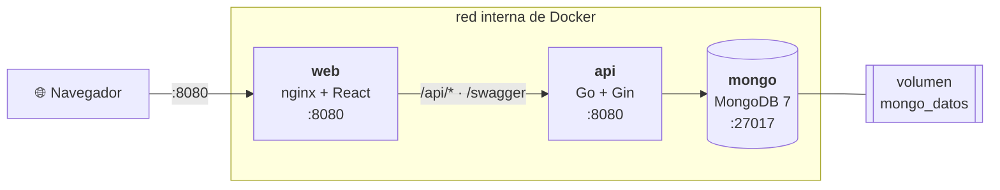
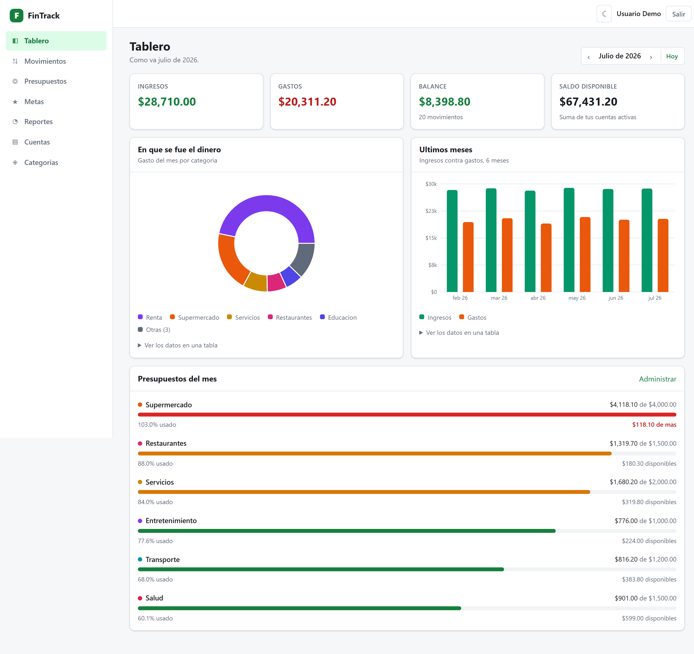

# FinTrack

Aplicación web de finanzas personales y presupuestos: registra tus ingresos y gastos, organízalos
por cuentas y categorías, ponles un límite mensual y mira a dónde se te va el dinero.

> **Estado:** completo. Las 11 fases (0 a 10) terminadas — ver la [tabla de avance](#avance-por-fases).

## Stack

| Capa | Tecnología |
|---|---|
| Base de datos | MongoDB 7 |
| Backend | Go 1.25+ · Gin · driver oficial `mongo-driver/v2` · JWT · bcrypt |
| Frontend | React 18 · Vite · React Router · axios · Recharts · CSS Modules |
| Infraestructura | Docker · Docker Compose · nginx · GitHub Actions |
| Pruebas | testify (Go) · colección de Postman |

## Arranque rápido

Lo único que hace falta es [Docker Desktop](https://www.docker.com/products/docker-desktop/).

```bash
git clone https://github.com/FNTR3455234/FinTrack.git
cd FinTrack

make arriba             # Windows sin make:  .\make.ps1 arriba
```

Eso genera un `.env` con secretos aleatorios, construye las dos imágenes y levanta los tres
servicios en orden. Cuando termina, **<http://localhost:8080>**.

La primera vez MongoDB crea el esquema y carga los datos de ejemplo por su cuenta. Entra con:

> **`demo@fintrack.mx`** / **`Demo1234!`** — 6 meses de historia: 3 cuentas, 10 categorías,
> 120 transacciones, 6 presupuestos y 3 metas de ahorro.

| | |
|---|---|
| `make abajo` | Detiene el stack (los datos se conservan) |
| `make logs` | Sigue la bitácora de los tres servicios |
| `make seed-prod` | Recarga el esquema y los datos de ejemplo |
| `docker compose down -v` | Detiene y **borra** los datos |

> La semilla está anclada a **julio de 2026** (`ANIO_FINAL` y `MES_FINAL` en
> `database/02_insertar_datos.js`). El tablero abre en el mes en curso, así que si hoy es un mes
> posterior verás ceros hasta pulsar la flecha de mes anterior; cambiando esas dos líneas y
> volviendo a correr la semilla los datos se re-anclan.

## Arranque para desarrollar

Con recarga en caliente. Requiere además Go 1.25+ y Node 18+.

```bash
# 1. Solo MongoDB en contenedor (proyecto aparte, volumen aparte)
make up

# 2. Configura y arranca la API en http://localhost:8080
cp backend/.env.example backend/.env
make dev

# 3. En otra terminal, el frontend en http://localhost:5173
make web
```

`make seed` recarga el esquema y los datos de ejemplo; `make down` detiene Mongo conservándolos.

## Atajos

Los mismos targets existen en `Makefile` (Linux/macOS/CI) y en `make.ps1` (Windows sin `make`):

| Atajo | Qué hace | Disponible desde |
|---|---|---|
| `make up` / `make down` | Levanta o detiene MongoDB | fase 0 |
| `make seed` | Recrea el esquema y carga los datos semilla | fase 1 |
| `make dev` | Levanta Mongo y arranca la API | fase 2 |
| `make web` | Arranca el frontend de Vite | fase 7 |
| `make lint` | `go vet` + `golangci-lint` | fase 2 |
| `make test` | Pruebas de Go con cobertura | fase 3 |
| `make test-integracion` | Todas las pruebas, incluidas las que usan MongoDB | fase 4 |
| `make build` | Compila backend y frontend | fase 7 |
| `make swagger` | Regenera la especificación OpenAPI | fase 6 |
| `make postman` | Corre la colección de Postman con Newman | fase 6 |
| `make env` | Genera un `.env` con secretos aleatorios | fase 8 |
| `make arriba` / `make abajo` | Levanta o detiene el stack completo | fase 8 |
| `make logs` / `make seed-prod` | Bitácora y semilla del stack completo | fase 8 |

`make help` (o `.\make.ps1`) lista todo.

## Arquitectura

Tres contenedores en una red privada. **Solo uno publica un puerto**: nginx sirve el frontend y
además pasa `/api` a la API, así que el navegador ve un único origen y no hay CORS de por medio.
Ni MongoDB ni la API son alcanzables desde fuera de la red.



El detalle —las dos imágenes multi-etapa, el arranque por orden de salud, el diagrama de
autenticación y por qué cada stack de Compose tiene su propio nombre de proyecto— está en
[`docs/arquitectura.md`](docs/arquitectura.md).

## La aplicación



| Pantalla | Qué hay |
|---|---|
| Tablero | Cifras del mes, reparto de gastos, seis meses de historia y las barras de presupuesto |
| Movimientos | Listado filtrable y paginado, alta y edición, exportar e importar CSV |
| Presupuestos | Límites del mes con su semáforo (en orden / cerca del límite / excedido) |
| Metas de ahorro | Cuánto llevas juntado, en qué estado va cada meta y a qué ritmo tendrías que ahorrar |
| Reportes | Las consultas relacionales, la tendencia y el saldo de cada cuenta |
| Cuentas y Categorías | Los catálogos, con archivado en lugar de borrado cuando hay movimientos |

Más capturas, incluido el tema oscuro, en [`frontend/README.md`](frontend/README.md#capturas).

## Documentación de la API

Con el stack levantado, la referencia interactiva está en **<http://localhost:8080/swagger>**:
40 operaciones con sus parámetros, sus cuerpos de ejemplo y sus códigos de error. El botón
*Authorize* acepta el token y deja probar cualquier endpoint desde el navegador.

## Integración continua

[`.github/workflows/ci.yml`](.github/workflows/ci.yml) corre en cada `push` a `main` y en cada
pull request:

| Trabajo | Qué comprueba |
|---|---|
| `backend` | `gofmt`, `go vet` y las pruebas **contra un MongoDB de verdad**, con cobertura |
| `frontend` | Que el bundle compila, y publica su tamaño |
| `imagenes` | Que los dos `Dockerfile` construyen |
| `contrato` | Levanta el **stack completo** y le pasa la colección de Postman |

## Calidad

Todo lo de esta tabla está medido contra el stack en contenedores, no estimado.

| | |
|---|---|
| Pruebas del backend | 10 paquetes en verde · **83.6 %** de cobertura · las de integración contra un MongoDB de verdad |
| Contrato de la API | 53 peticiones y **139 aserciones** de Postman, 0 fallos |
| Accesibilidad | **0 violaciones** de axe-core (WCAG 2.1 AA) en las 12 combinaciones de pantalla y tema |
| Rendimiento | Primer pintado en **60 ms** · 108 kB en la primera carga · API entre 4 y 11 ms |
| Consultas | Ninguna recorre la colección entera: `explain()` muestra `IXSCAN` en todas |
| Seguridad | `govulncheck` limpio · contenedores sin root · un solo puerto publicado |

El detalle, con cómo se midió cada cosa, está en
[`docs/arquitectura.md`](docs/arquitectura.md#revisión-de-seguridad).

## Documentación

| Documento | Contenido |
|---|---|
| [`docs/arquitectura.md`](docs/arquitectura.md) | Los tres contenedores, las capas, el aislamiento por usuario, la revisión de seguridad y las medidas de rendimiento |
| [`docs/despliegue.md`](docs/despliegue.md) | Poner esto en un servidor: TLS, respaldos, actualizaciones y qué **no** resuelve |
| [`docs/decisiones.md`](docs/decisiones.md) | Bitácora de las 45 decisiones técnicas y su porqué |
| [`database/modelo.md`](database/modelo.md) | Diagrama entidad-relación, relaciones e índices |

### Entregables

| # | Entregable | README |
|---|---|---|
| 1 | Base de datos: modelo, scripts de creación, semilla y respaldo | [`database/README.md`](database/README.md) ✅ |
| 2 | Backend: API REST en Go | [`backend/README.md`](backend/README.md) ✅ |
| 3 | Frontend: cliente en React | [`frontend/README.md`](frontend/README.md) ✅ |
| 4 | Pruebas: colección de Postman | [`postman/README.md`](postman/README.md) ✅ |

## Avance por fases

| Fase | Contenido | Estado |
|---|---|---|
| 0 | Estructura del repo, `.gitignore`, Compose de desarrollo, Makefile | ✅ |
| 1 | Base de datos: modelo, `$jsonSchema`, índices, semilla, respaldo | ✅ |
| 2 | Backend base: config, conexión, `/health`, errores, middlewares, apagado ordenado | ✅ |
| 3 | Autenticación: registro, login, refresh, perfil, rate limit | ✅ |
| 4 | CRUD de cuentas, categorías y transacciones con filtros y paginación | ✅ |
| 5 | Presupuestos, consultas relacionales, resumen, tendencia y alertas | ✅ |
| 6 | Exportar/importar CSV, Swagger, colección de Postman | ✅ |
| 7 | Frontend completo: React + Vite, tema claro/oscuro, gráficas y CSV | ✅ |
| 8 | Imágenes multi-etapa, Compose completo, nginx, CI y arquitectura | ✅ |
| 9 | Metas de ahorro: tercera consulta relacional, ritmo de ahorro y pantalla | ✅ |
| 10 | Accesibilidad, rendimiento, revisión de seguridad y guía de despliegue | ✅ |

## Licencia

[MIT](LICENSE).
