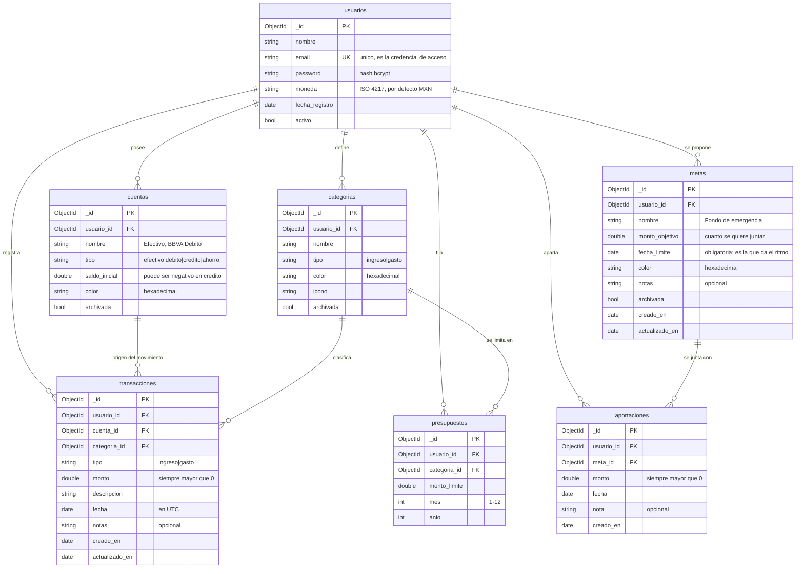

# Modelo de datos

## Diagrama

## Relaciones

Todas las relaciones son **uno a muchos** y se modelan por **referencia** (guardando el
`ObjectId` del documento padre), no por documentos embebidos.

| Relación | Cardinalidad | Por qué por referencia |
|---|---|---|
| usuario → cuentas | 1:N | Se consultan y editan de forma independiente del usuario |
| usuario → categorías | 1:N | Igual, y además son el objetivo de un `$lookup` |
| usuario → transacciones | 1:N | Crecen sin límite: embebidas harían crecer el documento del usuario hasta topar con el límite de 16 MB |
| usuario → presupuestos | 1:N | Un documento por categoría y periodo |
| cuenta → transacciones | 1:N | Una transacción sale de una sola cuenta |
| categoría → transacciones | 1:N | Una transacción pertenece a una sola categoría |
| categoría → presupuestos | 1:N | Una categoría puede tener un presupuesto por cada mes |
| usuario → metas | 1:N | Objetivos de ahorro, independientes entre sí |
| meta → aportaciones | 1:N | **Composición**: es la única relación en la que borrar el padre borra los hijos (ver más abajo) |

**Regla transversal:** todos los documentos, salvo `usuarios`, llevan `usuario_id`. Ninguna
consulta llega a MongoDB sin filtrar por ese campo, y su valor sale siempre del token JWT,
nunca del cuerpo de la petición. Es lo que impide que un usuario vea datos de otro.

## Notas de diseño

**`tipo` está en `transacciones` y también en `categorias`.** Es una duplicación deliberada: la
consulta de gastos por categoría filtra por `tipo: "gasto"` en la primera etapa, antes del
`$lookup`, y así descarta los ingresos sin tener que resolver la categoría de cada documento.
El costo es que hay que mantener la coherencia entre ambos: el servicio valida que el `tipo` de
la transacción coincida con el de su categoría.

**El saldo de una cuenta no se guarda.** Solo existe `saldo_inicial`; el saldo actual se calcula
sumando las transacciones. Guardar un saldo actualizado crearía una segunda fuente de verdad que
se desincroniza en cuanto se edita o borra una transacción vieja.

**`mes` y `anio` de `presupuestos` son enteros, no una fecha.** El presupuesto aplica al periodo
completo, no a un instante, y así el índice único `(usuario_id, categoria_id, mes, anio)` impide
duplicados de forma natural.

**El monto siempre es positivo.** Lo que decide si suma o resta es el campo `tipo`. Evita el
error clásico de tener signos mezclados en la misma colección.

**Lo ahorrado en una meta tampoco se guarda.** Misma regla que el saldo de una cuenta: se calcula
sumando sus aportaciones.

**Una aportación no es una transacción, y por eso está en otra colección.** Apartar 3,000 para un
viaje no es gastarlos: no sale de ninguna cuenta y no debe contar como gasto del mes. Si se
guardaran juntas, el total de gastos incluiría dinero que solo cambió de sitio, y tanto el resumen
como el semáforo de presupuestos mentirían.

**`meta → aportaciones` es la única relación con borrado en cascada.** Una transacción existe por
sí misma y solo se apoya en su categoría, así que borrar la categoría la dejaría huérfana: por eso
ahí la API responde `409` y obliga a archivar. Una aportación, en cambio, no significa nada sin su
meta —"3,000 el 15 de marzo" no es un dato suelto—, así que al borrar la meta se van con ella.
Como MongoDB está en modo standalone y no hay transacciones de varios documentos, **se borran
primero las aportaciones y después la meta**: si el segundo paso falla queda una meta sin
aportaciones (visible y se puede volver a borrar), y no aportaciones huérfanas que ya nadie ve.

## Índices

| Colección | Índice | Único | Para qué |
|---|---|---|---|
| usuarios | `email` | Sí | La credencial de acceso no se puede repetir; además acelera el login |
| cuentas | `usuario_id` | No | Listado de cuentas del usuario |
| categorias | `usuario_id` | No | Listado de categorías del usuario |
| transacciones | `usuario_id, fecha` (desc) | No | Listado principal: filtra por dueño y ordena por fecha con el mismo índice |
| transacciones | `usuario_id, categoria_id` | No | Consulta de gastos por categoría y el `$lookup` de presupuestos |
| presupuestos | `usuario_id, categoria_id, mes, anio` | Sí | Impide dos presupuestos para la misma categoría y periodo |
| metas | `usuario_id, fecha_limite` | No | Listado de metas del usuario, ya ordenado por lo que vence antes |
| aportaciones | `usuario_id, meta_id` | No | El `$lookup` que junta cada meta con sus aportaciones |

Se crean en `01_crear_colecciones.js` y también de forma programática al arrancar el servidor
(fase 2), en los dos casos de manera idempotente.

## Validación de esquema

Cada colección tiene un validador `$jsonSchema` con `validationAction: "error"`, es decir,
MongoDB **rechaza** la escritura que no cumpla. Valida tipos BSON, campos obligatorios, rangos
(`monto > 0`, `mes` entre 1 y 12), enumeraciones (`tipo`, `tipo` de cuenta) y formatos por
expresión regular (email, color hexadecimal). Además usa `additionalProperties: false`, así que
un campo mal escrito (`catgoria_id`) falla en vez de guardarse en silencio.

Es una segunda línea de defensa: la validación principal vive en el backend con
`go-playground/validator`, pero el esquema protege la base también de escrituras hechas a mano
desde `mongosh` o Compass.
