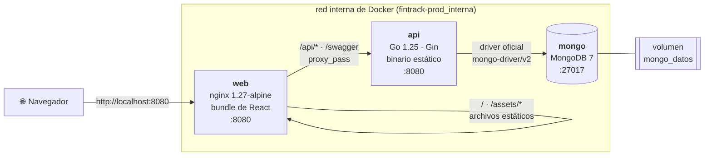
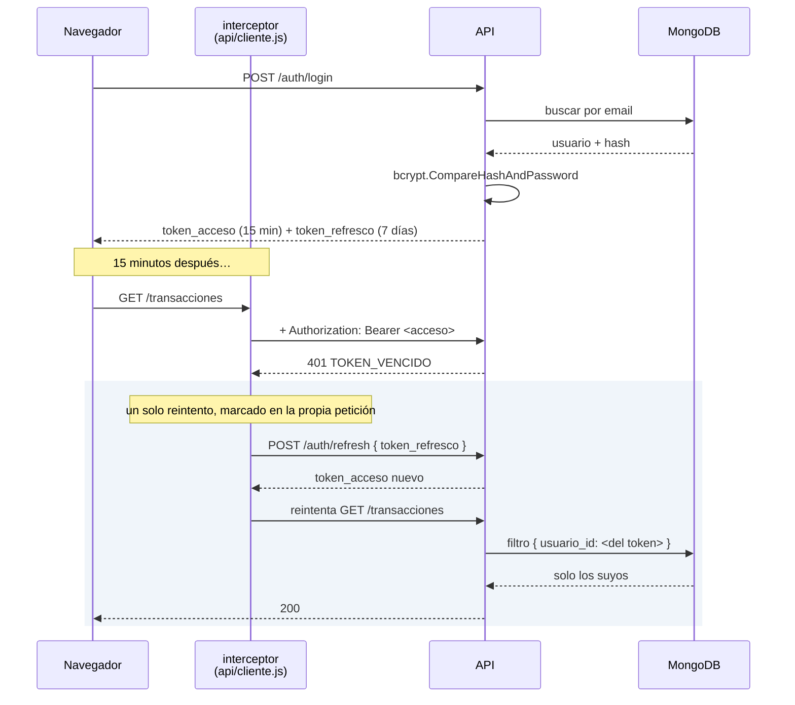

# Arquitectura de FinTrack

## Vista general

Tres contenedores en una red privada de Docker. **Solo uno publica un puerto.**



Lo que hay detrás de ese dibujo:

- **Un solo puerto publicado.** `mongo` y `api` no exponen nada a la máquina anfitriona. Para
  llegar a ellos hay que estar dentro de la red o entrar con `docker compose exec`. Una base de
  datos con el 27017 abierto al mundo es de las formas más comunes de filtrar datos.
- **Un solo origen para el navegador.** nginx sirve el frontend y además pasa `/api` a la API, así
  que el navegador nunca ve dos dominios: no hay CORS de por medio y `VITE_API_BASE=/api/v1` vale
  igual en desarrollo (proxy de Vite) que en producción (proxy de nginx).
- **El estado vive en un solo sitio.** `api` y `web` son desechables: se pueden borrar y volver a
  crear sin perder nada. Todo lo que persiste está en el volumen `mongo_datos`.
- **Arranque por orden de salud.** `api` no arranca hasta que Mongo responde al `ping`, y `web` no
  arranca hasta que `/api/v1/health` responde. Sin eso la API arrancaría primero, no conectaría y
  se apagaría (`main.go` hace `os.Exit(1)` si la conexión falla).

### Las dos imágenes

Las dos son multi-etapa: una etapa compila y la otra solo ejecuta. Lo que se manda a un servidor
es superficie de ataque, y ni el compilador ni el código fuente hacen falta para ejecutar.

| Imagen | Compila con | Ejecuta sobre | Tamaño | Usuario |
|---|---|---|---|---|
| `fintrack-api` | `golang:1.25-alpine` | `alpine:3.21` | ~64 MB | `fintrack` (uid 10001) |
| `fintrack-web` | `node:22-alpine` | `nginx:1.27-alpine` | ~83 MB | `nginx` |

El binario de Go se compila con `CGO_ENABLED=0`, así que es estático y no depende de la libc del
sistema; de Alpine solo se usan los certificados y `wget` para el *healthcheck*. La versión se
graba al compilar con `-ldflags`, así que `/api/v1/health` dice qué versión está desplegada.

### Los dos stacks de Compose

| Archivo | Proyecto | Qué levanta | Para qué |
|---|---|---|---|
| `docker-compose.dev.yml` | `fintrack-dev` | Solo MongoDB | Desarrollo: la API y el frontend corren a mano, con recarga en caliente |
| `docker-compose.yml` | `fintrack-prod` | Los tres servicios | La entrega: `docker compose up` y listo |

Los nombres de proyecto son **explícitos y distintos** a propósito. Sin ellos Compose usa el nombre
de la carpeta, que es el mismo para los dos archivos, y los dos stacks acaban compartiendo el
volumen `mongo_datos`. Como la imagen de Mongo solo crea el usuario administrador la primera vez,
con el directorio de datos vacío, el segundo stack se encuentra un volumen que ya trae el usuario
del primero y **no puede autenticarse nunca**. Ver la [decisión 033](decisiones.md).

## Capas del backend

El backend sigue un flujo en una sola dirección; cada capa solo conoce a la siguiente:

```
handlers  ->  servicios  ->  repositorios  ->  MongoDB
(HTTP)        (reglas)       (queries)
```

- **handlers** — parsean la petición, llaman al servicio y responden con el formato uniforme.
  No contienen reglas de negocio ni consultas.
- **servicios** — reglas de negocio y validaciones que cruzan entidades. Reciben los repositorios
  como interfaz, lo que permite mockearlos en las pruebas unitarias.
- **repositorios** — única capa que habla con MongoDB.
- **middleware, errores, modelos, config, db, rutas** — piezas transversales.

_(Pendiente: detallar el contrato de cada capa con ejemplos reales de código.)_

## Capas del frontend

El mismo principio, en el otro lado del cable:

```
paginas  ->  hooks  ->  api  ->  axios  ->  HTTP
(vista)      (estado)   (endpoints)
```

- **paginas** — la vista y el estado de la pantalla. No arman URLs ni tocan `localStorage`.
- **componentes** — lo que se repite (`Boton`, `Campo`, `Modal`, `Tarjeta`, las gráficas). Nunca
  importan de una página.
- **hooks** — `usePeticion` (leer: datos, cargando, error, recargar, con cancelación),
  `useAccion` (escribir: ocupado y error), `usePeriodo`, `useRetardo`.
- **api** — una función por endpoint. Devuelven ya el contenido de `datos`: el sobre
  `{ datos, meta }` es un detalle del transporte y no llega a los componentes.
- **contexto** — `AuthContexto` es el **único** sitio que escribe o borra tokens; `TemaContexto`
  es el único que toca el atributo `data-tema` de `<html>`.

El interceptor de `api/cliente.js` es la pieza con más reglas del cliente: adjunta el token,
renueva **una sola vez por petición** ante un `401` y comparte una única promesa de refresco entre
las peticiones que fallen a la vez (ver [decisión 027](decisiones.md)).

## Aislamiento por usuario

Regla innegociable: ninguna consulta llega a MongoDB sin filtrar por `usuario_id`, y ese
`usuario_id` sale siempre del token JWT, nunca del cuerpo de la petición.

El recorrido completo:

1. `middleware.Autenticacion` lee el encabezado `Authorization: Bearer <token>`, valida la firma
   y la vigencia, y saca el id del usuario del campo `sub` del token.
2. Lo guarda en el contexto de Gin con la llave `usuario_id`.
3. Los handlers lo leen con `middleware.UsuarioID(c)` y se lo pasan al servicio como argumento.
4. El repositorio lo mete en el filtro de **toda** consulta a MongoDB.

Si el id viniera del cuerpo o de la query, cualquiera podría pedir los datos de otro cambiando un
valor. Por eso los DTO de entrada **no tienen** un campo `usuario_id`: no hay forma de mandarlo.

En el repositorio, el paso 4 son dos funciones en `repositorios/comunes.go` por las que pasa toda
operación de un solo documento:

```go
func deUsuario(usuarioID bson.ObjectID) bson.M {
	return bson.M{"usuario_id": usuarioID}
}

func suyoPorID(usuarioID, id bson.ObjectID) bson.M {
	return bson.M{"_id": id, "usuario_id": usuarioID}
}
```

Por eso editar o borrar algo ajeno responde **404 y no 403**: un 403 confirmaría que el recurso
existe. Para el intruso, sencillamente no está.

### Los dos puntos donde el cliente elige un identificador

1. **Al crear una transacción** llegan `cuenta_id` y `categoria_id` en el cuerpo.
   `servicios.validarReferencias` comprueba las dos filtrando por usuario, así que un id ajeno
   "no existe". Lo mismo hace `Presupuestos.validarCategoria`.
2. **En las agregaciones de reportes** (fases 5 y 9), donde el riesgo es peor porque cruzan
   colecciones: un `$lookup` al que se le olvide el `usuario_id` sumaría dinero ajeno sin que ningún
   403 lo delate. Por eso los `$lookup` con `let` + `pipeline` de `reportes_presupuestos.go` y
   `reportes_metas.go` comparan `$$usr` además de la categoría o la meta, aunque el `$match` inicial
   ya haya filtrado. Hay pruebas de integración con dos usuarios reales que lo comprueban sobre las
   seis agregaciones.

### Las tres consultas relacionales

| # | Cruza | Responde | Código |
|---|---|---|---|
| 1 | `transacciones` → `categorias` | En qué se fue el dinero del mes | `reportes_gastos.go` |
| 2 | `presupuestos` → `categorias`, `transacciones` | Lo presupuestado contra lo gastado | `reportes_presupuestos.go` |
| 3 | `metas` → `aportaciones` | Lo que se quiere juntar contra lo que ya se juntó | `reportes_metas.go` |

Las tres, con su versión de `mongosh` y su resultado real contra la semilla, están en
[`database/README.md`](../database/README.md#las-tres-consultas-relacionales).

En la 3 el reparto de trabajo es explícito: **la agregación suma dinero y el servicio en Go calcula
el calendario** (estado, días restantes, ritmo mensual). Lo que depende de la fecha de hoy se saca
de la base a propósito, para poder probarlo con un reloj fijo ([decisión 040](decisiones.md)).

## Modelo de datos

Ver [`database/modelo.md`](../database/modelo.md) para el diagrama de colecciones y relaciones.

## Autenticación

Dos tokens firmados con secretos distintos: el de **acceso** (15 min) acompaña cada petición y el
de **refresco** (7 días) solo sirve para pedir uno de acceso nuevo. El detalle está en
[`../backend/README.md`](../backend/README.md#autenticación).

El recorrido completo, incluido lo que pasa cuando el token caduca a mitad de una sesión:



Si el refresco también falla, el interceptor borra la sesión y avisa a `AuthContexto`, que es quien
lleva al usuario al login. El cliente de axios no conoce react-router: solo avisa.

## Integración continua

`.github/workflows/ci.yml`, en cada `push` a `main` y en cada pull request:

| Trabajo | Qué comprueba |
|---|---|
| `backend` | `gofmt`, `go vet` y las pruebas **contra un MongoDB de verdad**, con cobertura |
| `frontend` | Que el bundle compila, y publica su tamaño en el resumen |
| `imagenes` | Que los dos `Dockerfile` construyen |
| `contrato` | Levanta el **stack completo** con Compose y le pasa la colección de Postman |

Los tres primeros van en paralelo; `contrato` espera a que pasen, porque tarda minutos y no tiene
sentido gastarlos si las pruebas unitarias ya fallaron. Las pruebas de integración usan un MongoDB
real y no un doble: comprueban agregaciones, índices únicos y el `$jsonSchema`, y eso un doble no
lo puede imitar sin acabar imitando también los errores.

## Revisión de seguridad

Repaso hecho en la fase 10, con lo que se comprobó y cómo.

| Frente | Cómo está resuelto | Comprobado con |
|---|---|---|
| **Aislamiento por usuario** | El `usuario_id` sale del token; los DTO de entrada ni siquiera tienen el campo. Editar algo ajeno da 404, no 403 | Pruebas de integración con dos usuarios reales sobre las seis agregaciones |
| **Inyección NoSQL** | Los cuerpos se deserializan a structs de Go con tipos: `{"email":{"$ne":null}}` no puede convertirse en `string`. Es inmunidad estructural, no un filtro | `POST /auth/login` con operadores de Mongo → `400 JSON_INVALIDO` |
| **Inyección de expresión regular** | La búsqueda pasa por `regexp.QuoteMeta` antes de llegar al `$regex` | `?busqueda=.*` devuelve **0** resultados, no los 120 |
| **Contraseñas** | bcrypt con el coste por defecto (10); el hash lleva `json:"-"` y no se serializa nunca | `GET /auth/perfil` no incluye `password` |
| **Fuerza bruta** | 20 peticiones por minuto e IP en `/auth` | El intento 20 responde `429 DEMASIADOS_INTENTOS` |
| **Tokens** | Dos secretos distintos y un campo `tipo` dentro del token: un refresco no vale como acceso ni aunque se programe mal la validación | Pruebas de `servicios/tokens` |
| **Cabeceras** | CSP `default-src 'self'`, `X-Frame-Options: DENY`, `nosniff`, `Referrer-Policy` — también en las respuestas de la API, porque pasan por nginx | `curl -D -` sobre `/` y sobre `/api/v1/health` |
| **Superficie expuesta** | Solo el puerto de nginx. MongoDB y la API no son alcanzables desde fuera de la red de Docker | `docker ps` y `docker compose config` |
| **Contenedores** | `api` corre como `fintrack` (uid 10001) y `web` como `nginx`; ninguno como root. La imagen de la API no lleva compilador, ni código fuente, ni `.env` | `docker exec … id` y `find /` dentro de la imagen |
| **Secretos** | Nada versionado. El `.env.example` trae valores que el servidor **rechaza** en modo release | `git ls-files`, `git check-ignore` |
| **Errores** | Un 5xx responde un mensaje genérico; el detalle solo va a la bitácora | `respuestas.Fallo` y sus pruebas |

### Dependencias

`govulncheck` encontró **una vulnerabilidad real**: `quic-go v0.59.0` (GO-2026-5676, agotamiento de
memoria por expansión de tráilers QPACK en HTTP/3), que entra como dependencia indirecta de Gin.
Se subió a `v0.59.1` y el análisis quedó limpio.

En el frontend, `npm audit` reporta avisos sobre React Router que **no aplican a esta aplicación**:
hablan de *open redirect* al pasar destinos controlados por el usuario a `<Link>` o `navigate()`,
y de CSRF en modo RSC. Aquí **todos los destinos son literales del propio código** (`/login`,
`/metas`…), no hay SSR ni RSC, y nada de la URL se usa para navegar. Se dejó la versión más nueva
(7.18) en lugar de bajar a 7.11, que cambia un aviso por otro. Ver la
[decisión 044](decisiones.md).

### Lo que sigue abierto

Está detallado en la [guía de despliegue](despliegue.md#8-lo-que-este-despliegue-no-resuelve): sin
alta disponibilidad, tokens de refresco no revocables antes de sus 7 días, sin recuperación de
contraseña, sin límite de peticiones fuera de `/auth` y sin métricas.

## Rendimiento

Medido contra el stack en contenedores con la semilla cargada (120 transacciones, 9 aportaciones).

| Medida | Resultado |
|---|---|
| Primer pintado, visitante nuevo y sin caché | **60 ms** |
| Lo que descarga quien entra al login | **108 kB** (102 de JS + 6 de CSS, comprimidos) |
| Peso del bundle sin comprimir → con gzip | 287 kB → **92 kB** |
| Trozo de las gráficas | 399 kB, **solo al abrir el tablero o los reportes** |
| Las cinco consultas de reporte | 4.8 – 10.6 ms |
| Listado de transacciones paginado | 4.4 ms |

Ninguna consulta hace un recorrido completo de colección. `explain()` sobre las más pesadas:

| Consulta | Plan |
|---|---|
| Listado de transacciones | `LIMIT ← FETCH ← IXSCAN [idx_transacciones_usuario_fecha]` — 20 documentos examinados para devolver 20 |
| Gastos por categoría | `IXSCAN [idx_transacciones_usuario_fecha]` |
| Aportaciones de una meta | `IXSCAN [idx_aportaciones_usuario_meta]` — 4 examinados, 4 devueltos |
| Login por email | `IXSCAN [idx_usuarios_email_unico]` — 1 examinado |

El índice `(usuario_id, fecha)` sirve a la vez para filtrar por dueño y para ordenar, así que el
listado principal no necesita ordenar en memoria.

## Accesibilidad

Auditado con **axe-core 4.12.1** (reglas WCAG 2.1 A y AA, más las de buenas prácticas) sobre las
doce combinaciones de pantalla y tema: **0 violaciones**. El detalle de lo que se corrigió está en
[`frontend/README.md`](../frontend/README.md#accesibilidad).

axe-core no es una dependencia del proyecto: se instala aparte y se inyecta en la página con el
protocolo de DevTools, para que una herramienta de auditoría no acabe dentro del bundle que se
despliega.

## Decisiones

Ver [`decisiones.md`](decisiones.md).
