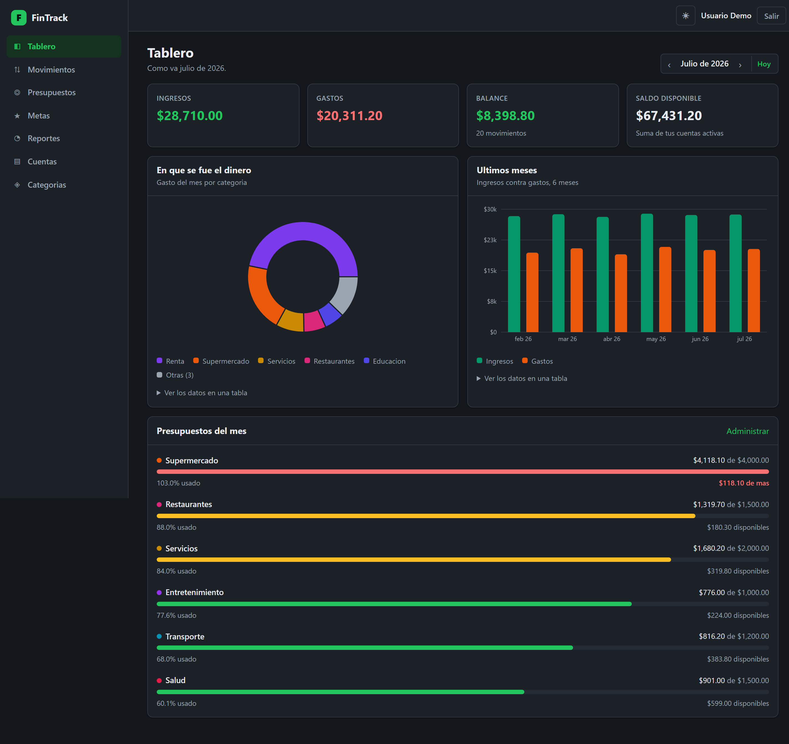
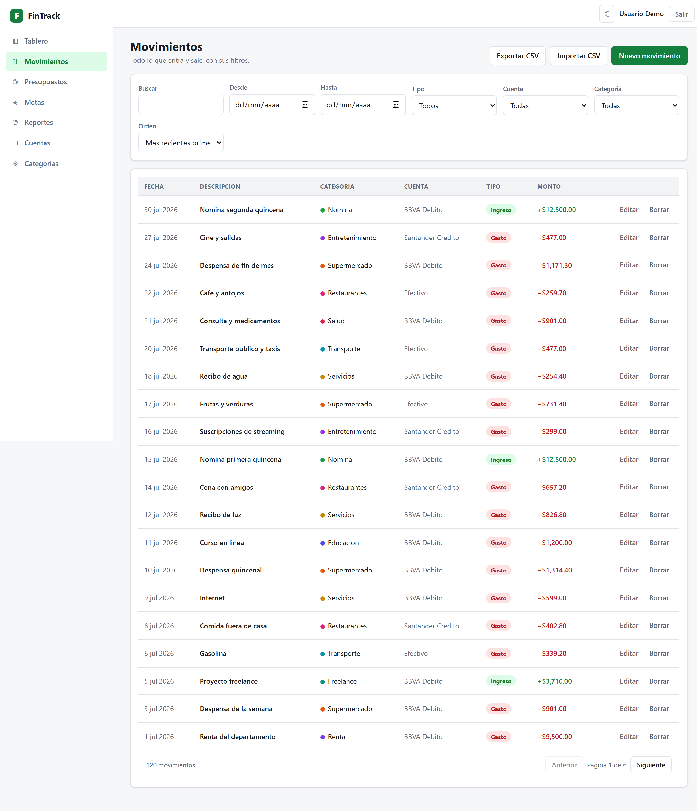
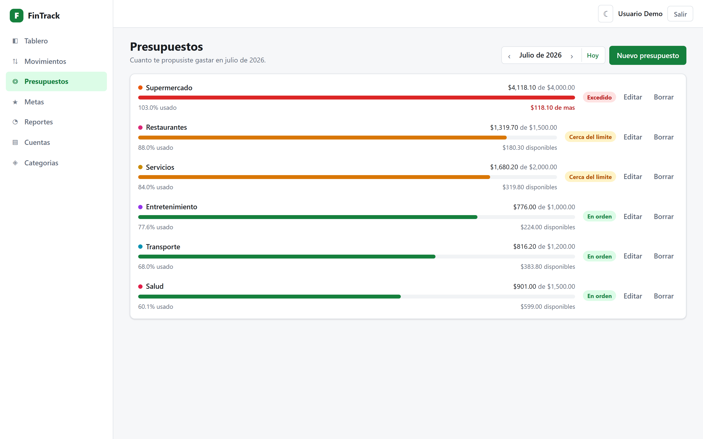
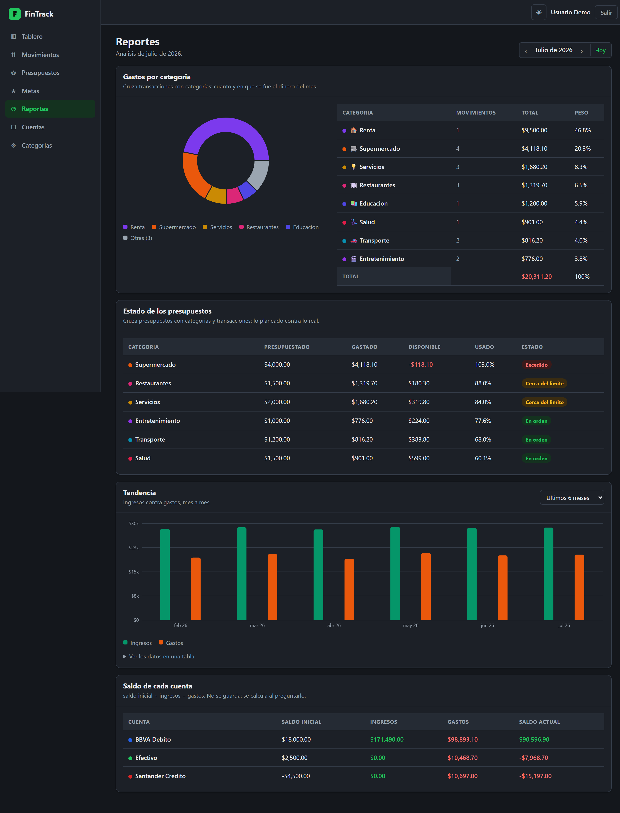
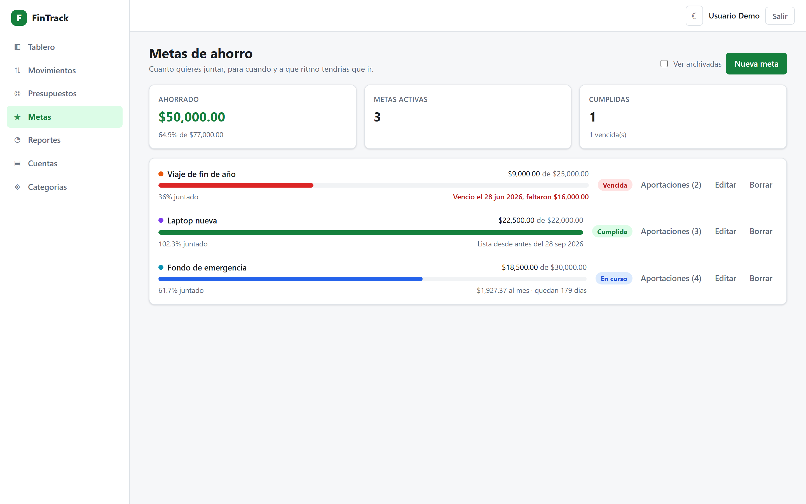
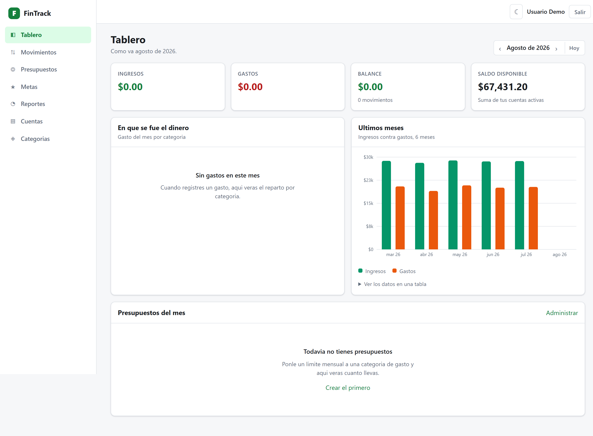

# Entregable 3 — Frontend

Cliente web de FinTrack: **React 18 + Vite**, JavaScript, CSS Modules, sin librería de
componentes. Consume la API del [entregable 2](../backend/README.md).

## Arranque

```bash
cd frontend
npm install
npm run dev            # http://localhost:5173
```

Necesita la API corriendo en el 8080 (`make dev` desde la raíz) y la semilla cargada
(`make seed`). Entra con **`demo@fintrack.mx` / `Demo1234!`**: son 6 meses de historia,
3 cuentas, 10 categorías, 120 movimientos, 6 presupuestos y 3 metas de ahorro.

| Comando | Qué hace |
|---|---|
| `npm run dev` | Servidor de desarrollo con recarga en caliente |
| `npm run build` | Compila a `dist/` |
| `npm run preview` | Sirve `dist/` para revisar el build |

No hay que configurar nada: `vite.config.js` deja un proxy de `/api` al 8080, así que en
desarrollo el navegador ve un solo origen y **no hay CORS de por medio**. Para apuntar a otro
backend, copia `.env.example` a `.env`.

### En contenedor

`Dockerfile` es multi-etapa: `node:22-alpine` compila y `nginx:1.27-alpine` sirve. En la imagen
final —unos 83 MB— no hay Node ni `node_modules`: un bundle compilado son archivos estáticos.
nginx corre como usuario sin privilegios y escucha en el 8080 (en Linux solo root puede abrir
puertos por debajo del 1024).

`nginx.conf` hace **lo mismo que el proxy de Vite en desarrollo**: sirve los archivos y pasa
`/api` y `/swagger` al backend. Por eso `VITE_API_BASE=/api/v1` vale igual en los dos entornos y
el navegador nunca ve dos orígenes. Además resuelve el *fallback* de aplicación de una sola página
(`try_files … /index.html`), sin el cual recargar en `/transacciones` daría 404, y separa el caché:
un año para `/assets/` —Vite les pone un hash del contenido en el nombre— y `no-cache` para
`index.html`, que es quien los nombra.

Las cabeceras de seguridad viven en `seguridad.conf` y se incluyen en cada `location`; el porqué
está en la [decisión 034](../docs/decisiones.md).

## Pantallas

| Ruta | Qué hay |
|---|---|
| `/login`, `/registro` | Entrada y alta. Únicas rutas públicas |
| `/` | Tablero: 4 cifras del mes, pastel de gastos, barras de 6 meses y las barras de presupuesto |
| `/transacciones` | Listado filtrable y paginado, alta y edición, exportar e importar CSV |
| `/presupuestos` | Límites del mes con su semáforo |
| `/metas` | Metas de ahorro con su progreso, su estado y el ritmo mensual necesario |
| `/reportes` | Las consultas relacionales 1 y 2, tendencia y saldo de cada cuenta |
| `/cuentas`, `/categorias` | Catálogos |
| `/perfil` | Nombre, moneda y tema |

## Cómo está organizado

```
src/
├── api/          una función por endpoint + el cliente de axios con sus interceptores
├── componentes/  lo que se repite: Boton, Campo, Modal, Tarjeta, Layout…
│   └── graficas/ Pastel y Barras, con su leyenda, su globo y su tabla equivalente
├── contexto/     AuthContexto (sesión) y TemaContexto (claro/oscuro)
├── hooks/        usePeticion, useAccion, usePeriodo, useRetardo
├── paginas/      una carpeta por pantalla con sus formularios
├── utiles/       formato de dinero, fechas y porcentajes
└── estilos/      variables del tema y estilos globales
```

Las capas van en un solo sentido: **página → hook → api → axios**. Ninguna página construye
una URL a mano ni toca `localStorage`; un componente nunca importa de otra página.

## Las cinco decisiones que vale la pena mirar

### 1. El 401 se reintenta una vez, y solo una

El token de acceso vive 15 minutos. En vez de comprobar su vencimiento en el cliente
—habría que decodificar el JWT y confiar en el reloj del navegador— se deja que la petición
falle con 401 y se renueva ahí. **Quien decide si un token sirve es el servidor.**

En `api/cliente.js`, tres detalles que no son adorno:

- La marca de reintento va en la config de la petición, no en una variable del módulo: el
  límite es *una vez por petición*, no *una vez por sesión*. Sin eso, un token de refresco
  vencido daría 401 → refresh → 401 → refresh en bucle.
- Si tres peticiones fallan a la vez, las tres se cuelgan de **la misma** promesa de refresco.
  Con tres refrescos en paralelo, el segundo y el tercero llegarían con el token viejo y
  cerrarían la sesión sin motivo.
- `/auth/login`, `/auth/registro` y `/auth/refresh` quedan fuera: ahí un 401 significa
  "credenciales malas", y renovar solo convertiría un mensaje claro en un cierre de sesión.
  Se listan una por una porque `/auth/perfil` empieza igual y esa sí debe reintentarse.

### 2. Los colores de las gráficas no son el verde y el rojo de la app

Verde `#16A34A` contra rojo `#DC2626` se separan **ΔE 5.0** para una persona con
deuteranopia: son prácticamente el mismo color. No es una impresión, está medido con un
validador de paletas. En una gráfica de barras el color es lo único que distingue una serie
de otra, así que ahí se usa **esmeralda `#059669` contra naranja `#EA580C`**, que llegan a
ΔE 10.1 y pasan todas las comprobaciones sobre las dos superficies, la clara y la oscura.

Son los mismos dos valores en los dos temas: están elegidos para funcionar en ambos, no
invertidos de uno a otro.

El verde y el rojo de siempre se quedan donde el color **acompaña a una palabra**
("Ingreso", "Gasto", "Excedido") y por lo tanto no es la única pista.

### 3. Ninguna gráfica es la única forma de leer un dato

Cada gráfica lleva debajo un `<details>` con la misma información en una tabla. Un globo que
solo aparece al pasar el ratón no sirve con teclado, ni con lector de pantalla, ni impreso en
blanco y negro. Además:

- Los colores de las categorías los elige el usuario, así que **no se pueden validar de
  antemano**: la app no puede depender de ellos, y por eso cada porción lleva su nombre en la
  leyenda y su fila en la tabla.
- El pastel agrupa a partir de la sexta categoría en una porción "Otras": pasadas seis
  porciones las de abajo son astillas que no se pueden comparar. La cola sigue entera en la
  tabla.
- Las barras de presupuesto se recortan al 100% aunque el porcentaje sea 140. Una barra que
  se sale de su caja no dice "me pasé mucho", dice "esto está roto"; que se pasó lo dicen el
  color y la cifra.

### 4. Al recargar, lo viejo se atenúa; no vuelve el esqueleto

Los esqueletos salen **una sola vez**, cuando todavía no hay nada que enseñar. Al cambiar de
mes o de página, lo que ya estaba se queda a media opacidad hasta que llegan los datos
nuevos. Volver al esqueleto en cada recarga haría saltar la maquetación y perdería el sitio
donde estaba el usuario.

### 5. Los modales son `<dialog>` nativo

`showModal()` trae hechas tres cosas que a mano cuestan bastante y casi siempre acaban mal:
el foco queda atrapado dentro, Escape cierra, y el resto de la página queda inerte para el
ratón y para los lectores de pantalla.

## Accesibilidad

Auditado con **axe-core 4.12.1** (WCAG 2.1 A y AA, más buenas prácticas) sobre las doce
combinaciones de pantalla y tema: **0 violaciones**.

axe-core no es una dependencia del proyecto. Se instala aparte y se inyecta en la página con el
protocolo de DevTools, para que una herramienta de auditoría no acabe dentro del bundle:

```bash
npm install axe-core                   # fuera del repo
# se carga con Runtime.evaluate en un navegador sin ventana y se ejecuta axe.run()
```

### Lo que ya estaba

- Enlace de "saltar al contenido" como primer elemento tabulable.
- Un solo estilo de foco visible en los dos temas, con `:focus-visible`.
- Toda etiqueta unida a su control por `id` (lo genera `useId`); los errores se anuncian con
  `role="alert"` y se enlazan con `aria-describedby`.
- El semáforo de presupuestos, el estado de las metas y el tipo de movimiento **siempre llevan
  texto**, nunca solo color.
- Las barras de progreso son `role="progressbar"` con sus valores.
- El emoji de las categorías va con `aria-hidden`: es decoración, el nombre ya está ahí.
- Se respeta `prefers-reduced-motion` y `prefers-color-scheme`.

Verificado además a mano: el `<dialog>` nativo **atrapa el foco** (25 tabuladores seguidos siguen
dentro) y Escape lo cierra; `lang="es"`; una sola `<h1>` por página; puntos de referencia
`nav`, `main` y `header` con nombre.

### Lo que la auditoría encontró, y no era poco

**83 nodos con contraste insuficiente, todos en el tema claro.** La causa: los colores semánticos
se usaban a la vez como relleno y como texto, y WCAG pide cosas distintas para cada uso. Medido:
`#16a34a` sobre blanco da 3.30:1 y dentro de una etiqueta verde pálida 3.00:1, cuando se necesita
4.5:1.

Ahora cada color existe dos veces: `--ingreso` es el **relleno** (barras, puntos: sin texto encima
le basta 3:1) y `--ingreso-tinta` es la **tinta** para texto, un paso más oscura. En el tema oscuro
coinciden, porque sobre superficie oscura los mismos colores ya dan de 5.65:1 para arriba — por eso
el tema oscuro pasó limpio desde el principio. Ver la
[decisión 042](../docs/decisiones.md).

**18 nodos sin texto alternativo en el pastel.** Recharts marca cada porción como `role="img"` sin
etiqueta, así que un lector de pantalla anunciaba seis "imagen" seguidas. Ahora las porciones van
con `aria-hidden` y el contenedor lleva `role="img"` con un nombre: es **una** imagen, y los
números están en la tabla de siempre.

## Rendimiento

El tablero y los reportes se cargan con `lazy()`. Recharts pesa más que todo el resto de la
aplicación junta, y así quien entra al login o registra un movimiento no lo descarga:

```
index.js     287 kB  (92 kB gzip)   ← todo menos las gráficas
Pastel.js    399 kB  (104 kB gzip)  ← recharts, solo en /tablero y /reportes
```

Medido contra el stack en contenedores, con la caché del navegador desactivada:

| | |
|---|---|
| Primer pintado con contenido | **60 ms** |
| Lo que descarga un visitante sin sesión en `/login` | **108 kB** — dos archivos, y **ninguno** es el de las gráficas |
| Respuesta de la API | 4.4 – 10.6 ms |

Comprobado de verdad, no supuesto: en una sesión limpia, la lista de recursos que pidió el
navegador en `/login` son `index.js` y `index.css`, y nada más.

## Limitaciones conocidas

- **Los tokens viven en `localStorage`.** Una cookie `httpOnly` sería más segura contra XSS,
  pero exigiría que el backend la emitiera y la validara, y eso cambiaría el contrato de la
  fase 3. Queda anotado en [`docs/decisiones.md`](../docs/decisiones.md).
- **La alerta de presupuesto solo aparece al crear**, no al editar: es lo que devuelve la API
  (`POST /transacciones` incluye `alerta`, `PUT` no).
- **La importación de CSV no tiene vista previa.** El archivo se valida entero y, si algo
  falla, no se guarda nada y se listan las filas a corregir.
- **Sin pruebas automatizadas del frontend.** La verificación de esta fase fue manual contra
  la API viva, endpoint por endpoint. Añadir Vitest y Testing Library es trabajo de una fase
  posterior.

## Capturas

Tomadas del stack en contenedores (`make arriba`) con los datos de ejemplo.

| | |
|---|---|
|  |  |
| **Tablero**, tema claro | El mismo, tema oscuro |
|  |  |
| **Movimientos** con filtros y paginación | **Presupuestos** con el semáforo del mes |
|  |  |
| **Reportes**: las consultas relacionales | **Metas de ahorro** con sus tres estados |
|  | |
| **Entrada** | |
